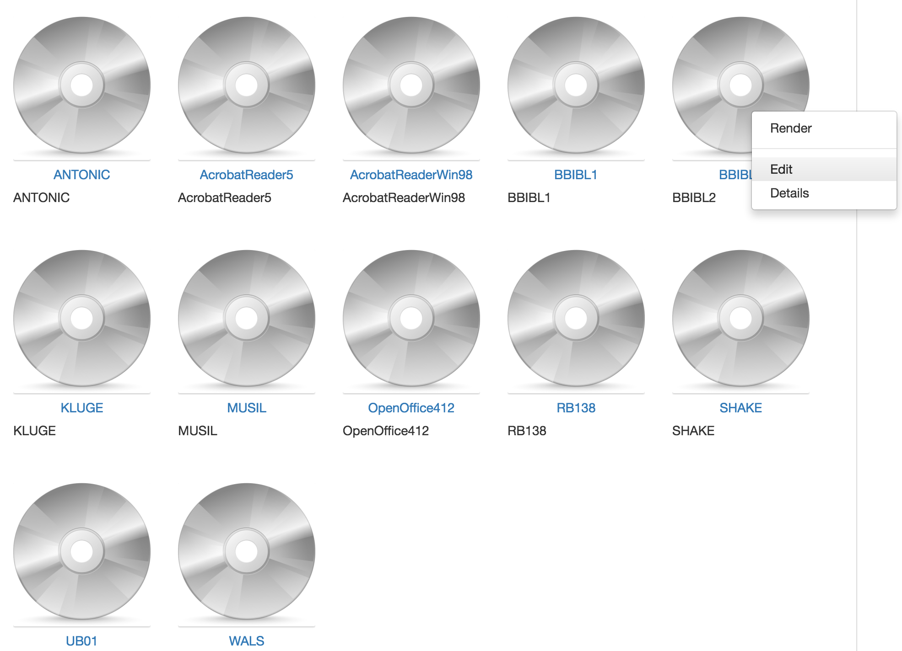
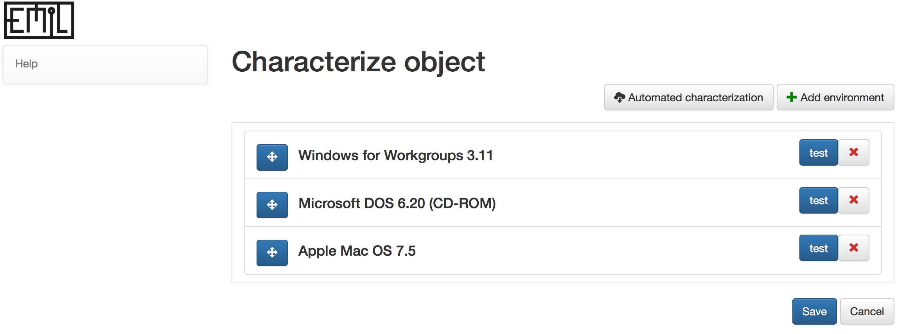
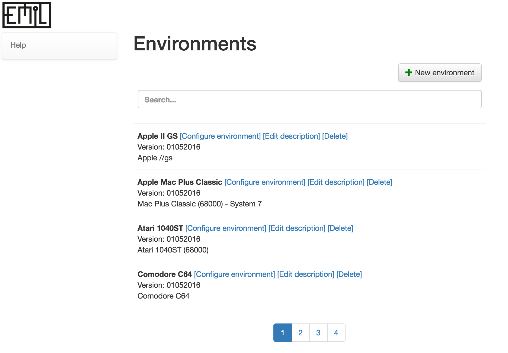
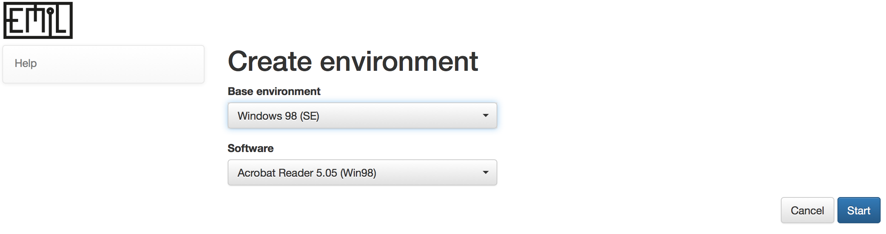
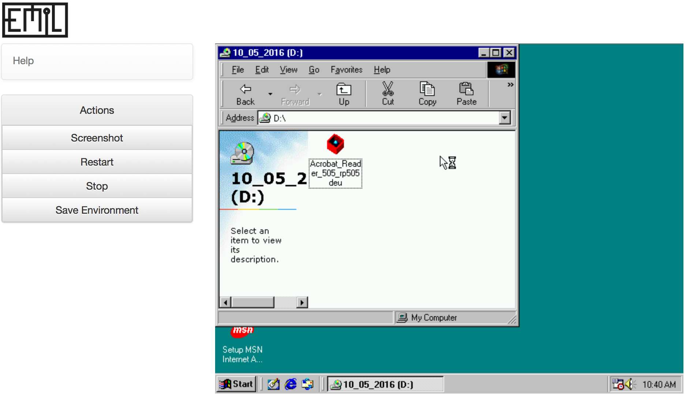
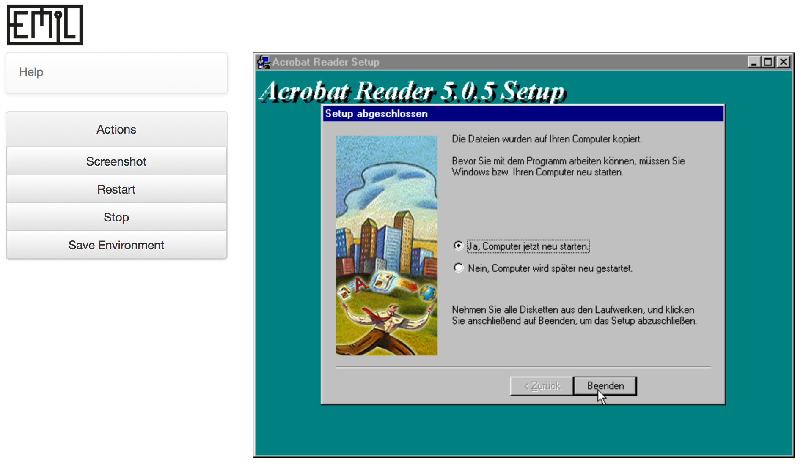
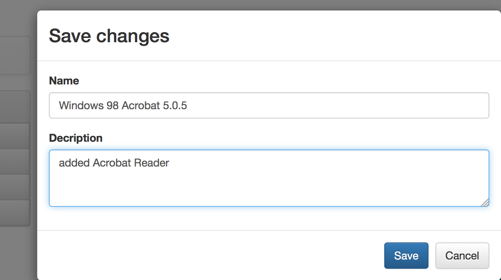
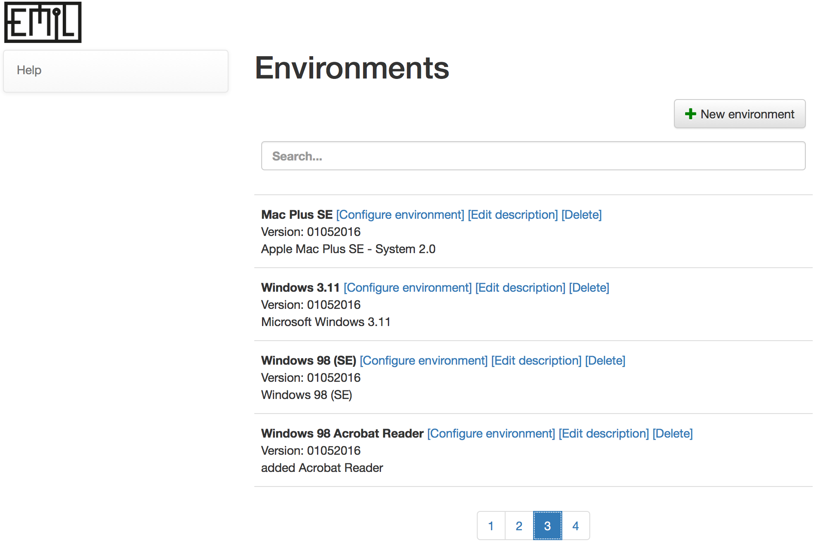

## Administrative UI

Entrypoint catalog

=======
Edit an object's emulation environments

=======
Management of available environments

=======
Create new environment

=======
Create new environment

=======
Create new environment

=======
Create new environment

=======
Create new environment

