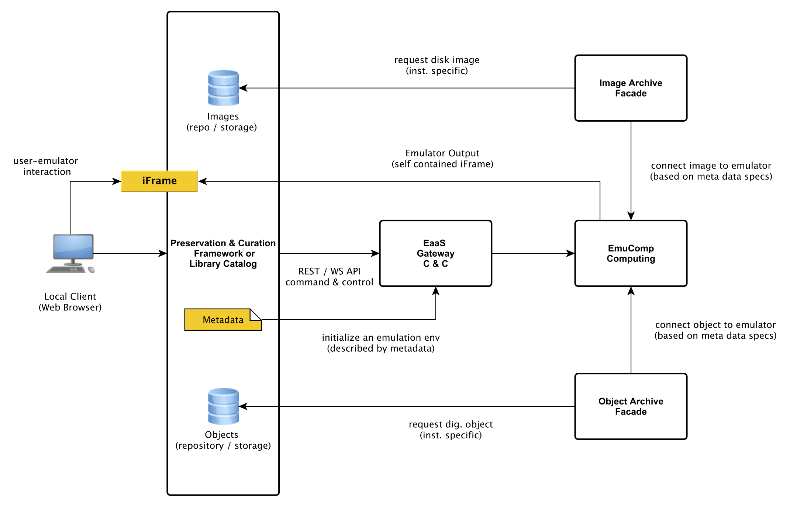

# Integrating EMiL

## Available components/modules

### Front-end
The EMiL front-end is typically implemented as part of a third-party system (e.g. a library catalog). It 
provides an interface to use the EaaS/EMiL API through HTTP requests (RESTful interface). A sample user 
interface is provided by the EMiL project [(live demo)](http://demo.bw-fla.uni-freiburg.de). 

### EaaS Gateway (EaaS/EMiL API end-point)
The EaaS Gateway acts as API end-point and manages all emulation related resources (e.g. session tracking,
allocation of compute resources etc.). 

*Hardware requirements*
- Low-end server machine, 1 CPU, 4-8Gb RAM
- Optimize for latency

### Image Archive (Connector)
The image-archive provides access to virtual disk images (and their meta-data) used in emulation sessions.
The image-archive module can either act as a connector to a third-party provided storage system or repository 
or as a simple file-based archive managing images locally. 

*Hardware requirements*
- Low-end server machine, 1 CPU, 4-8Gb RAM
- Storage, if images are stored locally and optimize for i/o-throughput 
- If possible, deploy together with the eaas-module

### Object Archive (Connector)
The object-archive module provides access to a digital object collection. The object-archive module is able to 
act either as a connector to a third party repository or as a simple file-based archive, managing files locally.

*Hardware requirements*
- Low-end server machine, 1 CPU, 4-8Gb RAM
- Storage, if images are stored locally and optimize for i/o-throughput 
- If possible, deploy together with the eaas-module

### Emulation Component 
An emulation component module allocates locally available CPU resources to serve emulation sessions. 

*Hardware requirements*
 - CPU-optimized server machine(s)
 - General maintenance / application server overhead 1 CPU, 2-4Gb Ram  
 - estimate 1 CPU and 1 GB Ram per emulation session
 
 
