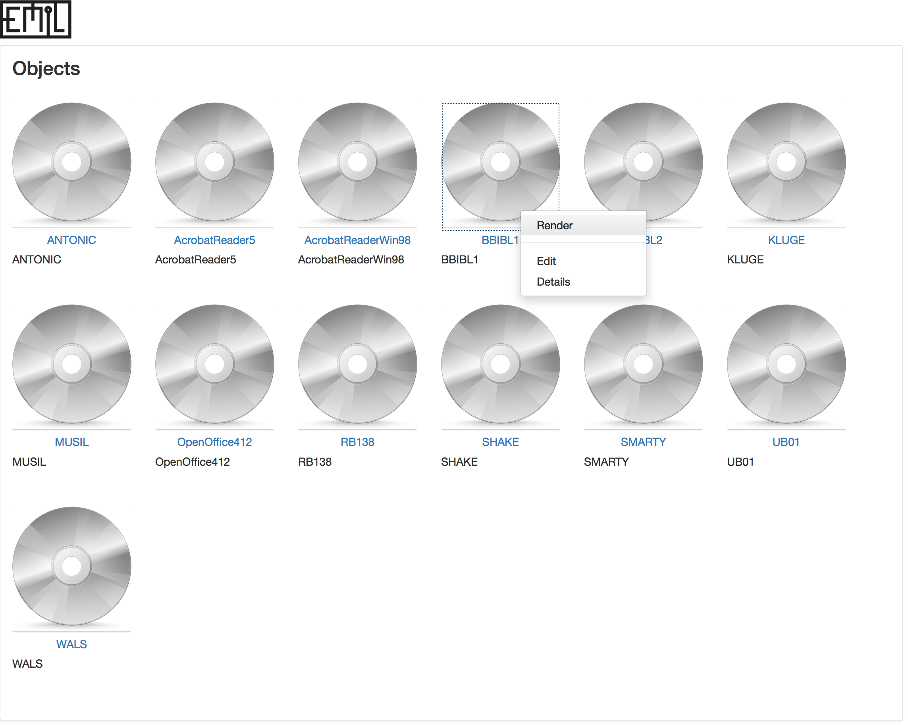
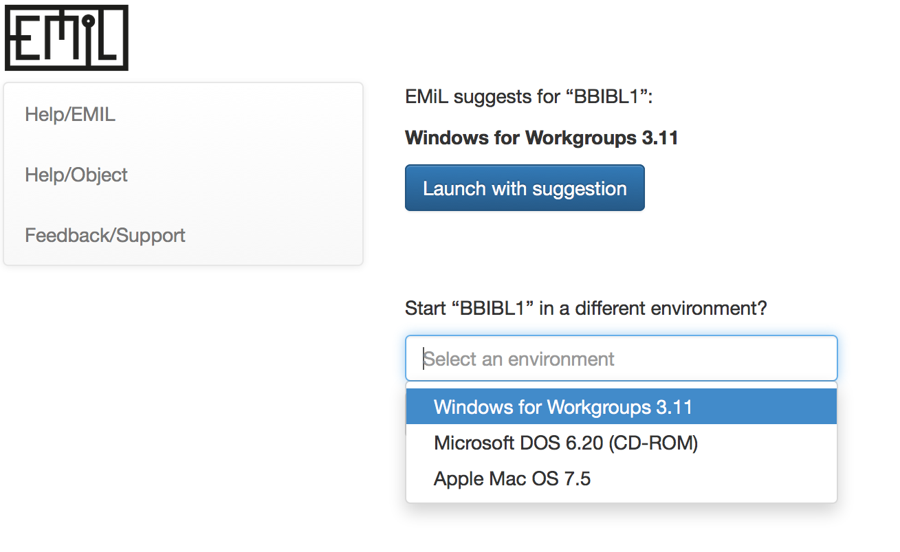
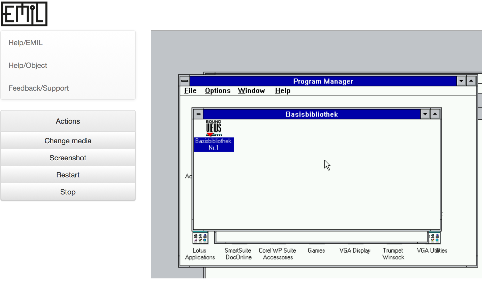

# User View

Entrypoint catalog

=======
Object context (user view) - internal objectId is available and a list of suitable environments has been loaded.

=======
Object rendering (user view) - rendering of the object with chosen environment.

=======
Object rendering (change media)

